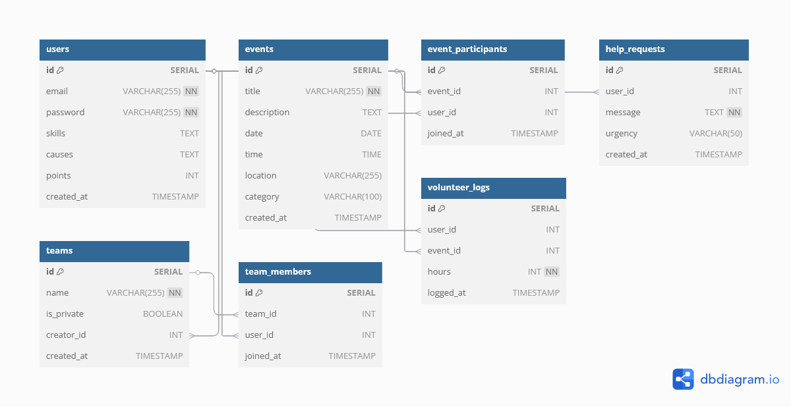

# Volunteer App

## Project Overview

The Volunteer App is a platform that connects volunteers with community events, help requests, and teams. Users can register, log in, join events, post help requests, track their impact, and join teams.

## Technologies Used

- Node.js
- Express.js
- PostgreSQL
- React
- Tailwind CSS
- Vite
- JWT (JSON Web Tokens)
- bcrypt

## Features

- User registration and authentication
- Create, list, and join events
- Post and view community help requests
- Track volunteer hours and view leaderboard
- Create and join teams

## Database Schema



## Setup Instructions

1. **Clone the repository:**

   ```sh
   git clone https://github.com/yourusername/volunteer-app.git
   cd volunteer-app
   ```

2. **Install dependencies:**

   ```sh
   cd backend
   npm install
   cd ../frontend
   npm install
   ```

3. **Configure the environment:**
   Create a `.env` file in the `backend` directory with the following content:

   ```env
   DB_HOST=localhost
   DB_PORT=5432
   DB_USER=postgres
   DB_PASSWORD=taj201100
   DB_NAME=hands_on_db
   PORT=3000
   ```

4. **Run the backend server:**

   ```sh
   cd backend
   npm start
   ```

5. **Run the frontend server:**
   ```sh
   cd frontend
   npm run dev
   ```

## API Documentation

### Authentication

- **POST /api/auth/register**

  - Request Body: `{ email, password, skills, causes }`
  - Response: `{ id, email, skills, causes }`

- **POST /api/auth/login**
  - Request Body: `{ email, password }`
  - Response: `{ token, user: { id, email, skills, causes } }`

### Events

- **GET /api/events**

  - Response: `[{ id, title, description, date, time, location, category }]`

- **POST /api/events**

  - Request Body: `{ title, description, date, time, location, category }`
  - Response: `{ id, title, description, date, time, location, category }`

- **POST /api/events/:eventId/join**
  - Request Body: `{ userId }`
  - Response: `{ id, event_id, user_id }`

### Help Requests

- **GET /api/help**

  - Response: `[{ id, user_id, message, urgency, created_at }]`

- **POST /api/help**
  - Request Body: `{ userId, message, urgency }`
  - Response: `{ id, user_id, message, urgency, created_at }`

### Impact Tracker

- **POST /api/impact/log**

  - Request Body: `{ userId, hours, eventId }`
  - Response: `{ id, user_id, hours, event_id }`

- **GET /api/impact/leaderboard**
  - Response: `[{ id, email, points }]`

### Teams

- **GET /api/teams**

  - Response: `[{ id, name, is_private, creator_id, created_at }]`

- **POST /api/teams**

  - Request Body: `{ name, isPrivate, creatorId }`
  - Response: `{ id, name, is_private, creator_id, created_at }`

- **POST /api/teams/:teamId/join**
  - Request Body: `{ userId }`
  - Response: `{ id, team_id, user_id }`

### Users

- **GET /api/users**
  - Response: `[{ id, email, skills, causes }]`

## Running the Project

### Locally

1. Follow the setup instructions to install dependencies and configure the environment.
2. Run the backend and frontend servers as described above.

### In Production

1. Build the frontend:
   ```sh
   cd frontend
   npm run build
   ```
2. Deploy the backend and frontend to your preferred hosting service.
3. Ensure the environment variables are set correctly on the production server.
